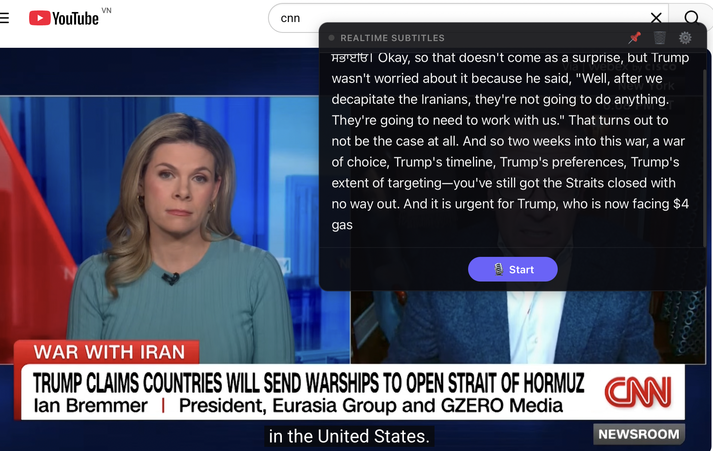

# 🎙 Realtime Subtitles

> An always-on-top desktop overlay that transcribes speech in real-time using [Soniox AI](https://soniox.com) — built for meetings, video calls, news, or any audio source.



---

## ✨ Features

- **Realtime transcription** — speech appears word-by-word as you speak
- **Always-on-top overlay** — floats above any app (Zoom, YouTube, Meet, Teams...)
- **Transparent dark UI** — minimal, non-intrusive design
- **Draggable window** — position anywhere on screen
- **Pin / unpin** always-on-top with one click
- **60+ languages** — powered by Soniox's universal speech model
- **Rolling transcript** — keeps last ~80 words in view, auto-scrolls
- **macOS native** — built with Tauri v2, runs on Apple Silicon (M1/M2/M3)

---

## 🏗️ Architecture

```
Microphone (CPAL)
    │
    ▼ F32 PCM @ 48kHz
Resample → 16kHz mono
    │
    ▼ i16 PCM chunks (100ms)
WebSocket ──────────────────► Soniox RT API
                                (stt-rt-v4 model)
                                    │
                              JSON tokens
                           {text, is_final}
                                    │
                                    ▼
                          Tauri event: "transcript"
                                    │
                                    ▼
                         React overlay UI
                    (stable + live hypothesis)
```

**Stack:**
| Layer | Technology |
|---|---|
| Desktop shell | [Tauri v2](https://tauri.app) |
| Frontend | React + TypeScript + Vite |
| Audio capture | [CPAL](https://github.com/RustAudio/cpal) (Rust) |
| Speech AI | [Soniox](https://soniox.com) WebSocket RT API |
| State | Tauri Plugin Store |
| Platform | macOS (Apple Silicon) |

---

## 🚀 Getting Started

### Prerequisites

- macOS (Apple Silicon M1/M2/M3)
- [Rust](https://rustup.rs) (≥ 1.77)
- [Node.js](https://nodejs.org) (≥ 18)
- [Soniox API key](https://console.soniox.com) (free tier available)

### Install & Run

```bash
# Clone
git clone https://github.com/ngocp-0847/soniox-subtitle.git
cd soniox-subtitle

# Install JS dependencies
npm install

# Run in dev mode
npm run tauri dev
```

### First-time Setup

1. **Grant microphone permission** — macOS will prompt on first launch. If not:
   - System Preferences → Privacy & Security → Microphone → enable **Terminal**
   - Restart Terminal after granting

2. **Add your API key** — click ⚙️ Settings in the app → paste your Soniox API key → Save

3. **Start transcribing** — click **🎙 Start** and speak

---

## 🎬 Usage

| Action | How |
|---|---|
| Start/Stop | Click **🎙 Start** / **⏹ Stop** |
| Move window | Drag the titlebar |
| Always-on-top | Click 📌 (toggle) |
| Clear text | Click 🗑️ |
| Change API key | Click ⚙️ Settings |

---

## 🔧 Configuration

The app stores your API key locally using Tauri's secure store at:
```
~/Library/Application Support/com.soniox-subtitle.app/settings.json
```

No data is sent anywhere except directly to Soniox's API for transcription.

---

## 📡 Soniox WebSocket Protocol

The app uses Soniox's **Real-time WebSocket API**:

```
wss://stt-rt.soniox.com/transcribe-websocket
```

**Handshake** (text JSON sent first):
```json
{
  "api_key": "...",
  "model": "stt-rt-v4",
  "audio_format": "pcm_s16le",
  "sample_rate": 16000,
  "num_channels": 1,
  "include_word_timing": true
}
```

**Audio stream**: binary frames of raw 16-bit PCM at 16kHz, ~100ms chunks

**Response tokens**:
```json
{
  "tokens": [
    { "text": "Hello", "is_final": true },
    { "text": " world", "is_final": false }
  ]
}
```

- `is_final: true` → committed word, appended to stable transcript
- `is_final: false` → live hypothesis, shown temporarily

---

## 🏠 Project Structure

```
soniox-subtitle/
├── src/                        # React frontend
│   ├── App.tsx                 # Main app + recording state
│   ├── components/
│   │   └── Settings.tsx        # API key config panel
│   └── styles/
│       ├── App.css             # Overlay dark theme
│       └── index.css
├── src-tauri/                  # Rust backend
│   ├── src/
│   │   ├── main.rs             # Tauri commands (start/stop/settings)
│   │   ├── audio.rs            # CPAL capture + WebSocket streaming
│   │   └── settings.rs
│   ├── tauri.conf.json         # Window config (transparent, always-on-top)
│   ├── entitlements.plist      # macOS mic entitlement
│   └── Info.plist              # NSMicrophoneUsageDescription
└── assets/
    └── screenshot.png          # Live demo screenshot
```

---

## 🛠️ Build for Production

```bash
npm run tauri build
# Output: src-tauri/target/release/bundle/macos/
```

---

## 📄 License

MIT

---

## 🙏 Credits

- [Soniox](https://soniox.com) — blazing fast, accurate speech AI
- [Tauri](https://tauri.app) — lightweight Rust-powered desktop apps
- [CPAL](https://github.com/RustAudio/cpal) — cross-platform audio I/O in Rust
